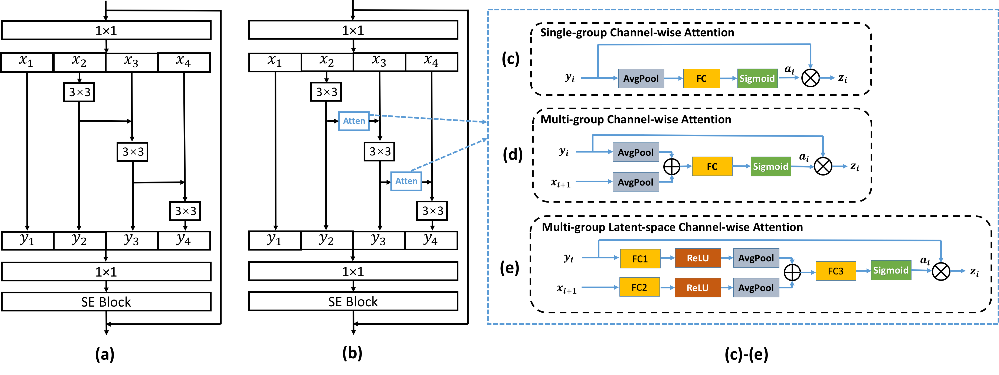
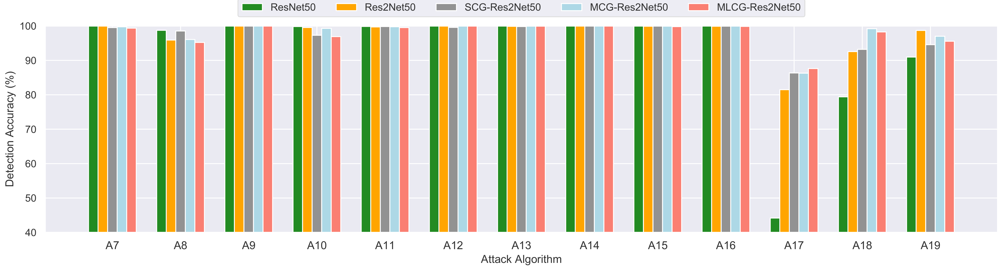

# Channel-wise-Gated-Res2Net
This repository provides the implementation of the paper:
[Channel-wise Gated Res2Net: Towards Robust Detection of Synthetic Speech Attacks](https://arxiv.org/pdf/2107.08803.pdf) (INTERSPEECH 2021).

## The Architecture of Channel-wise Gated Res2Net
<div  align="center"> </div>

## Main Results
1. The EER(%) and t-DCF of different network architectures on the ASVspoof2019 logical access.


2. The detection accuracy on each attack, given different network architectures with EER operating points. A16 and A19 are two attacks from the training set but trained with different training data. A17 is the most difficult unseen attack.
<div  align="center"></div>


## Dependencies
1. Python and packages
   This code was tested on Python 3.7 with PyTorch 1.6.0.
   Other packages can be installed by:

   ```bash
   pip install -r requirements.txt
   ```

2. Kaldi
   This work used Kaldi to extract the spectrogram acoustic feature, you need to install [Kaldi](https://github.com/kaldi-asr/kaldi) before running our scripts.

## Dataset
   This work is conducted on the logical access of [ASVspoof2019 Dataset](https://arxiv.org/pdf/1904.05441.pdf), which can be downloaded via https://datashare.ed.ac.uk/handle/10283/3336. It consists of attacks generated by different voice conversion and text-to-speech algorithms.

## Start Your Project
   This repository mainly consists of three parts: (i) feature extraction, (ii) system training and (iii) system evaluation.

### Feature extraction
   The conducted experiments in the paper were based on the CQT feature, while this repo provides codes for three feature extraction, i.e. Spec, LFCC and CQT. The top script for feature extraction is `extract_feats.sh`, where the first step (Stage 0) is to prepare dataset before feature extraction, followed by feature extraction for Spec (Stage 1), CQT (Stage 2) and LFCC (Stage 3). All features are required to be truncated by Stage 4.

   Given your dataset directory in `extract_feats.sh`, you can run any stage (e.g. NUM) in the `extract_feats.sh` by
   ```bash
   ./extract_feats.sh --stage NUM
   ```

### System training
   This repo supports different system architectures, as configured in the `conf/training_mdl` directory. You can specify the `modelconfig`, `feats`, etc., in `start_training_evaluation.sh`, then run the codes below to train and evaluate your models.
   ```bash
   ./start.sh
   ```
   Remember to rename your `runid` in `start_training_evaluation.sh` to differentiate each configuration.
   
### System evaluation
   For evaluating systems, you can either use the Kaldi command `compute-eer` with the resulting `*.eer` file to compute system EER, e.g.
   ```bash
   . ./path.sh
   compute-eer NameofScoringFile.txt.eer
   ```
   or use the ASVspoof2019 official script `scoring/evaluate_tDCF_asvspoof19.py` with the resulting `*.txt` file to compute both system EER and t-DCF, e.g. on the LA evalation set, you need to run
   ```bash
   python scoring/evaluate_tDCF_asvspoof19.py scoring/la_asv_scores/ASVspoof2019.LA.asv.eval.gi.trl.scores.txt NameofScoringFile.txt
   ```

## Citation
If this repo is helpful with your research or projects, please kindly star our repo and cite our paper as follows:
```
@article{li2021channel,
  title={Channel-wise Gated Res2Net: Towards Robust Detection of Synthetic Speech Attacks},
  author={Li, Xu and Wu, Xixin and Lu, Hui and Liu, Xunying and Meng, Helen},
  journal={Proc. Interspeech 2021},
  year={2021}
}
```

## Contact

- [Xu Li](https://lixucuhk.github.io/) at the Chinese University of Hong Kong (xuli@se.cuhk.edu.hk, xuliustc1306@gmail.com)
- If you have any questions or suggestions, please feel free to contact Xu Li via xuli@se.cuhk.edu.hk or xuliustc1306@gmail.com.


